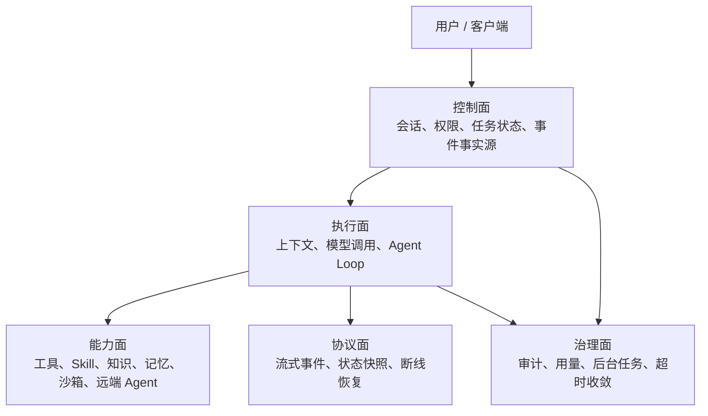

# Agent 框架笔记：先把边界画清楚

这篇是我对 Agent 框架的一次阶段性整理。它不是框架选型，也不是某个内部项目的拆解。我更想记录的是：当一个 Agent 从聊天 demo 往真实工程里走时，哪些边界必须先出现。

我一开始也很容易被 Supervisor、Planner、Worker、Router 这些词吸引。它们听上去像成熟框架的标配。但做了一段时间后，我越来越觉得，Agent 框架不是先把角色凑齐，而是先把不确定性关住。

模型会多次调用工具，会失败，会重复，会要求用户输入，会被取消，会写记忆，会调用外部能力。业务系统却要确定：这条消息是否提交了，任务是否完成了，工具有没有执行，用户有没有授权，失败后能不能恢复。这个矛盾处理不好，再漂亮的角色设计都会变成一团线。

## 早期想法：一个 Agent 服务包所有事情

最早的结构很简单：用户消息进来，一个 Agent 服务负责构建上下文、调用模型、执行工具、读知识库、写记忆、推送流式结果。要接新能力，就往这个服务里加。

这种方式在验证阶段很快。所有状态都在一个地方，调试也直观。但问题会逐渐累积：

- 业务状态和模型执行状态混在一起。
- 工具是否能执行，常常被模型“想调用”这件事带着走。
- 远端 Agent 或外部工具被当成本地函数，缺少权限边界。
- 任务失败后，很难知道到底停在哪一步。
- 后台异步任务和用户请求互相影响。

我后来意识到，这不是代码组织问题，而是架构边界问题。

## 后来的拆分：控制面、执行面、能力面

我现在更愿意把 Agent 框架拆成几层来看：

控制面负责确定性：谁发起任务、任务状态是什么、事件有没有保存、用户有没有权限。

执行面负责不确定性：模型如何推理，是否调用工具，是否进入等待，是否被取消。

能力面负责扩展性：工具、知识、记忆、沙箱、远端 Agent 都可以接进来，但不能绕过执行策略。

协议面负责把运行过程讲给前端听，既要实时，也要可恢复。

治理面负责那些不应该阻塞主链路但必须做的事，比如记忆提取、审计、用量统计、超时清理。

Supervisor 可以不是一个模型，而是一组状态机、租约、超时收敛、后台清理机制。Router 可以不是一个对话角色，而是模型路由、工具路由、provider 路由和能力开关。Worker 也不一定是另一个 Agent，可能是后台任务，也可能是被受控调用的远端能力。

## 关键取舍

单体 Agent 服务很快，但会让所有风险集中在一个地方。分层后链路变长，但失败更容易被定位，权限更容易控制，后续扩展也更稳。

完整多 Agent Runtime 很诱人，但如果单 Agent 的状态、工具、事件、取消、恢复还没做好，多 Agent 只会把问题放大。我的经验是：先把单 Agent 的可靠执行做扎实，再谈复杂协作。

远端 Agent 最好先当作高风险工具接入。它可以被调用，但要有任务边界、权限范围、输出标记、取消策略。不要一开始就让它接管主会话。

## 踩过的坑

第一个坑，是把角色名词当架构。写了 Supervisor，不代表系统真的可监督；写了 Planner，不代表计划能恢复；写了 Worker，不代表副作用可控。

第二个坑，是让模型拥有过多执行权。模型可以表达意图，但平台必须保留执行权。

第三个坑，是忽略事件事实源。Agent 不是一次请求响应，而是一串运行事件。没有事件，就没有恢复、审计和排障。

第四个坑，是把记忆、反思、远端能力都塞进主循环。它们应该通过策略和事件接入，而不是变成主循环里的隐式副作用。

## 现在的记录

如果我再设计一次 Agent 框架，我会先写下这些约束：

- 控制面和执行面从一开始就分开。
- 工具、知识、记忆、沙箱都是能力层，不直接污染主流程。
- 事件是事实源，实时流只是体验层。
- 远端 Agent 先通过受控 handoff 接入。
- 不急着做完整多 Agent，先把单 Agent 跑稳。

一句话总结：Agent 框架的成熟，不在角色有多少，而在模型的不确定行为有没有被工程边界接住。

## Podcast 提纲

1. 为什么 Agent 框架不该从角色名词开始。
2. 单体 Agent 服务为什么前期快、后期乱。
3. 控制面、执行面、能力面各自解决什么。
4. Supervisor、Router、Worker 在工程里的另一种理解。
5. 远端 Agent 和完整多 Agent Runtime 的区别。
6. 为什么事件事实源比角色设计更基础。
7. 如果重做，我会最先画哪几条边界。
