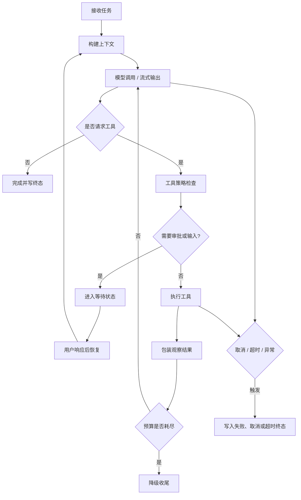
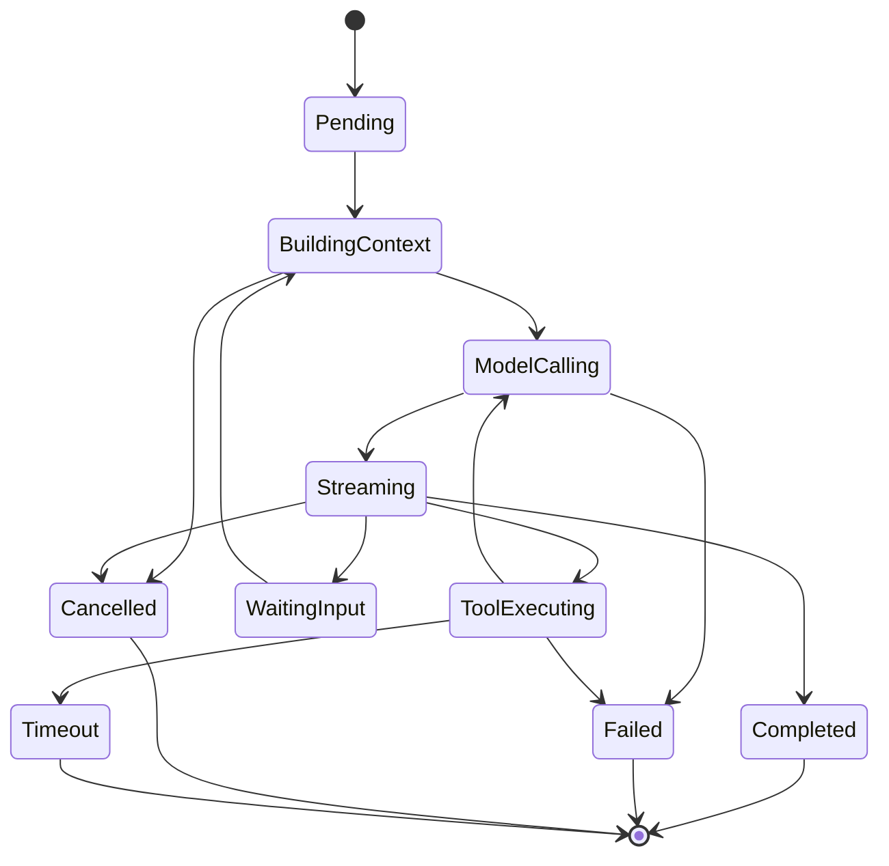

# Agent Loop 笔记：别让模型循环失控

Agent Loop 最容易被写成一个 while 循环：模型输出，检查有没有工具调用，有就执行工具，把结果塞回去，再问模型。这个结构很直观，但真实系统里远远不够。

我现在对 Agent Loop 的理解是：它不是自动思考的表演，而是一个可恢复的执行系统。模型只是系统里的一个参与方，工具、状态、事件、预算、取消、人工输入都在这个循环里。

## 最早的问题

早期 Loop 跑简单任务很顺。用户问问题，模型需要工具就调工具，工具结果回来，模型给最终答案。

真正的问题出现在异常路径：

- 工具失败后，模型可能反复尝试。
- 同一个工具可能被重复调用，甚至产生重复副作用。
- 上下文越来越长，工具调用和工具结果可能被压缩切断。
- 用户点取消，但模型流或工具任务还在后台运行。
- 模型已经流式输出一半，再失败时不好重试。
- 工具需要用户确认时，系统不知道该如何暂停和恢复。

这些问题说明 Loop 不能只靠模型自觉停下来。

## 当前更稳的 Loop 结构

这个循环里，关键不是“模型还能不能继续想”，而是每一步都要能被系统接住。

工具执行前，要检查 allowlist、风险、审批、调用次数。工具执行后，要把输出包装成不可信观察结果。模型继续之前，要检查预算。用户中断时，要进入明确状态，而不是停在某个内存栈里。

## 状态机比 while 循环重要

状态机的价值是让系统知道自己在哪里。没有状态机时，取消、恢复、超时都会变成一堆 if。

等待用户输入尤其要进入状态机。它不是 UI 弹窗，而是执行过程的一部分。系统要知道：为什么停，等谁回答，回答后怎么恢复。

## Reflection 不一定要做成角色

我以前也想做一个单独的 Reflection Agent。后来发现，很多反思可以先工程化：

- 工具失败多次后停止重试。
- 重复工具调用被预算拦住。
- 产物生成后做校验。
- 循环达到上限后让模型做最终合成。
- 完成后提取候选记忆。

这些机制比让模型写一句“我反思了”更有用。

## 踩过的坑

工具副作用重复执行是大坑。只读工具问题不大，但写文件、写记忆、调用外部系统时，重试和恢复都可能造成重复副作用。Loop 要有幂等意识。

取消也容易做假。只把任务状态改成 cancelled，并不代表模型流和工具任务真的停了。取消必须尽量传到执行端。

上下文压缩也要小心。不能把 tool call 和 tool result 切开，否则下一轮模型会看到不完整历史。

流式失败要分阶段处理。模型还没输出时，可以考虑切换候选模型；已经输出后，就不能简单重放。

## 现在的记录

如果重新做 Loop，我会先定义状态和事件，再写模型调用。模型调用只是一个节点，不是整个 Loop。

我也会从第一版就加预算、取消、工具幂等和等待恢复。越晚补，返工越大。

一句话总结：Agent Loop 的重点不是让模型一直想，而是让模型、工具、用户输入和失败都能被可恢复的执行系统接住。

## Podcast 提纲

1. Agent Loop 为什么不是普通 while 循环。
2. 工具失败和重复调用如何让 Loop 失控。
3. 状态机在取消、恢复、等待输入里的作用。
4. 工具观察结果为什么要包装成不可信输入。
5. Reflection 为什么可以先工程化。
6. 流式失败和普通失败有什么区别。
7. 如果重做，为什么先写状态和事件。
