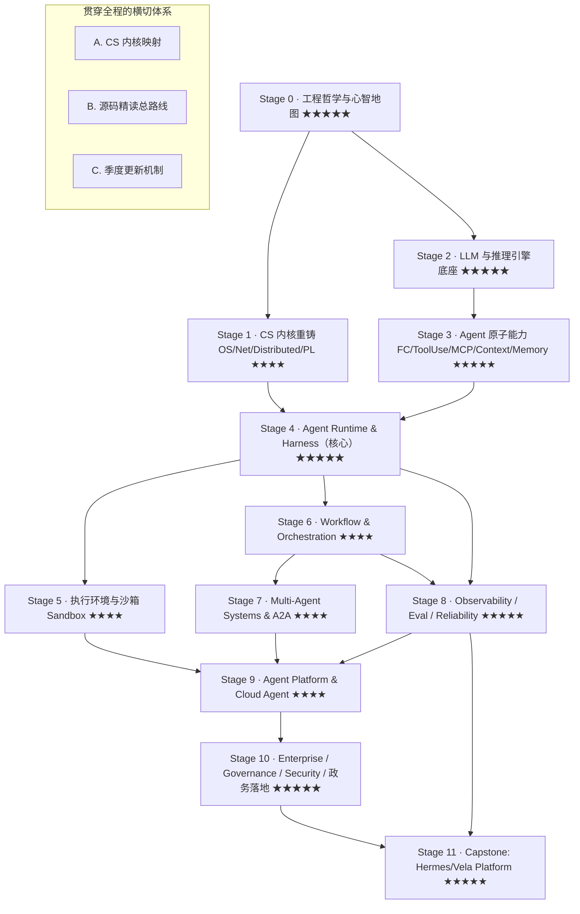

# AI Agent 工程学 · 技术路线与知识地图

> **一份写给自己的博客写作路线图，覆盖生产级 AI Agent 工程学的完整知识体系。**
>
> 未来 18–24 个月，我将在[Agent 开发](/agent/)专栏下，按照这条路线逐模块深入学习并输出博客。这篇文章是总目录 —— 每完成一个模块，我会回来把标题改成可点击的链接。
>
> **目标读者画像**：有后端工程经验、已接触 LLM 部署/RAG/MCP/LangGraph/Agent Loop，正在自建 Agent 框架，面向企业/政务客户，目标成长为 AI Agent 基础设施架构师的工程师。
>
> **时效基线**：2026 年年中。所有判断基于一手来源（Anthropic Engineering、各厂商 SDK release、Manus/Sourcegraph 等）。

---

## 0. 如何使用这份地图

这份地图有三条正交的轴，任何一个模块都同时挂在这三条轴上：

1. **工程学纵轴（Stage 0 → 11）**：按操作系统/网络/分布式/LLM/Runtime/Sandbox/Workflow/Multi-Agent/Observability/Platform/Governance 组织，框架只是案例。
2. **演进史横轴（主线叙事）**：Function Calling → Tool Use → MCP → Context Engineering → Agent Runtime/Harness → Sandbox → Workflow → Agent Platform → Multi-Agent → Cloud Agent → AI-Native Infra。每个技术都放在这条线上讲"为什么出现、上一代为什么不够、未来怎么演进"。
3. **三套横切体系（贯穿所有阶段）**：
   - **A. CS 内核映射**（MIT/CMU/Stanford ↔ Agent 系统）
   - **B. 源码精读总路线**（精确到入口文件/核心类/关键调用链）
   - **C. 季度更新机制**（自动纳入新论文/官方博客/Conference）

每个 Stage 的博客都会遵循一个固定结构：**定位 → 为什么（演进史锚点）→ 核心概念 → 关键架构决策（ADR）→ 源码精读 → 横向对比 → 实践 → 持续关注源**。

---

## 1. 全局主线叙事：这套博客要回答的那一个问题

> **"如何把一个无状态的、会幻觉的、按 token 计费的语言模型，变成一个能在生产环境里长时间自主运行、可审计、可治理、可扩展的系统？"**

围绕这个问题，整条演进线是这样展开的：

| 时代 | 核心抽象 | 解决了什么 | 为什么不够 → 催生下一代 |
|---|---|---|---|
| 2023 | **Function Calling** | 让模型能触发结构化调用 | 每家 schema 不同、工具与 agent 强耦合 |
| 2023–24 | **Tool Use / ReAct Loop** | 模型在循环里自主用工具 | 工具集成 N×M 爆炸、无标准协议 |
| 2024–25 | **MCP（Model Context Protocol）** | 工具/资源/上下文的标准化接口 | 只解决"连接"，不解决"上下文治理" |
| 2025 | **Context Engineering** | 把有限的 context 当作稀缺资源来经营 | 需要一个能承载它的运行时载体 |
| 2025–26 | **Agent Runtime / Harness** | 循环、状态、事件流、恢复、compaction | 单机、单租户，无法平台化 |
| 2026 | **Agent Platform / Managed Agents** | 多租户、托管、meta-harness、会话持久化 | 单 agent 能力天花板 |
| 2026+ | **Multi-Agent + A2A + Cloud Agent** | agent 之间协作、跨厂商互通 | 治理、安全、成本、可靠性成为主战场 |
| 2027? | **AI-Native Infrastructure / OS** | agent 成为一等公民的操作系统级抽象 | —（这是我们要去建设的地方）|

**贯穿全程的两个"北极星"判断（2026 已被工业界验证）：**

- **The Bitter Lesson 适用于 harness 设计**：不要过早训练自己的模型或把假设写死进 harness——模型每次升级都会让一部分 harness 逻辑变成"死重"（Anthropic 在 Sonnet 4.5→Opus 4.5 上亲历："context anxiety" 的补丁在新模型上变成了 dead weight）。**用 Context Engineering 作为随模型进步而弯曲的柔性接口。**
- **KV-cache 命中率是生产级 Agent 的头号指标**（Manus 论证：agent 输入输出比约 100:1，缓存 vs 非缓存有约 10x 成本差）。它反过来约束了几乎所有上层设计：稳定前缀、append-only 上下文、"mask 不 remove" 工具。

---

## 2. 阶段依赖关系图

**关键依赖说明：**

- Stage 2（LLM 底座）和 Stage 1（CS 内核）可**并行**启动，两者都是 Stage 4 的前置。
- Stage 4（Runtime/Harness）是整张图的重心——它是自建 Agent 框架的直接对照。Stage 5/6/8 都从它分叉。
- Stage 8（Observability/Eval）建议**尽早开始、贯穿始终**（"没有 eval 的 agent 不是工程，是玄学"），图上虽画在中段，但心态上从 Stage 3 就要建立。
- Stage 10（政务/治理）是**差异化护城河**，不是最后才想的事——private deployment / 可审计 / 数据主权的约束会反向影响 Stage 4/5/9 的架构选择。

---

## 3. 阶段总览与博客计划

| Stage | 名称 | 重要度 | 建议周期 | 计划博客数 | 前置 | 状态 |
|---|---|---|---|---|---|---|
| 0 | 工程哲学与心智地图 | ★★★★★ | 2 周 | 2–3 篇 | — | 🔜 即将开始 |
| 1 | CS 内核重铸（OS/Net/Distributed/PL/DB） | ★★★★ | 8–10 周 | 5–6 篇 | S0 | ⏳ 计划中 |
| 2 | LLM 与推理引擎底座 | ★★★★★ | 6–8 周 | 4–5 篇 | S0 | ⏳ 计划中 |
| 3 | Agent 原子能力 | ★★★★★ | 8–10 周 | 6–8 篇 | S2 | ⏳ 计划中 |
| 4 | Agent Runtime & Harness | ★★★★★ | 10–12 周 | 8–10 篇 | S1,S3 | ⏳ 计划中 |
| 5 | 执行环境与沙箱 | ★★★★ | 5–6 周 | 3–4 篇 | S4 | ⏳ 计划中 |
| 6 | Workflow & Orchestration | ★★★★ | 6–8 周 | 4–5 篇 | S4 | ⏳ 计划中 |
| 7 | Multi-Agent & A2A | ★★★★ | 5–6 周 | 3–4 篇 | S6 | ⏳ 计划中 |
| 8 | Observability / Eval / Reliability | ★★★★★ | 6–8 周 | 5–6 篇 | S4,S6 | ⏳ 计划中 |
| 9 | Agent Platform & Cloud Agent | ★★★★ | 8–10 周 | 5–6 篇 | S5,S7,S8 | ⏳ 计划中 |
| 10 | Enterprise / Governance / Security / 政务 | ★★★★★ | 6–8 周 | 5–6 篇 | S9 | ⏳ 计划中 |
| 11 | Capstone: 自建 Agent Platform | ★★★★★ | 12–16 周 | 4–5 篇 | S10,S8 | ⏳ 计划中 |

**总量估算**：约 55–70 篇博客，覆盖 18–24 个月。按每周 10–12h 学习 + 1–2 篇博客的节奏推进。

---

## 4. 逐阶段博客目录

### Stage 0 · 工程哲学与心智地图 ★★★★★（第 1–2 周）

> **定位**：在写任何一行代码之前，先建立"为什么"的框架。这是全系列唯一一个"世界观"阶段。

| # | 计划文章 | 核心内容 | 状态 |
|---|---|---|---|
| 0.1 | **AI Agent 演进史：从 Function Calling 到 AI-Native Infra** | FC → ToolUse → MCP → ContextEng → Runtime → Platform → MultiAgent → AI-Native 的完整演进叙事 | 🔜 |
| 0.2 | **The Bitter Lesson 如何影响 Agent 架构设计** | 为什么不该过早训模型/写死假设；Context Engineering 作为柔性接口 | 🔜 |
| 0.3 | **什么是 Agent：定义、边界与争议** | Anthropic 定义 vs 行业分歧；Workflow vs Agent 的决策框架 | 🔜 |

**必读一手资料**：
- Anthropic《Building effective agents》+《Effective context engineering for AI agents》（2025-09）
- Manus《Context Engineering for AI Agents: Lessons from Building Manus》（Part 1 & 2）
- Rich Sutton《The Bitter Lesson》原文
- Anthropic《Scaling Managed Agents: Decoupling the brain from the hands》（2026-04）

---

### Stage 1 · CS 内核重铸 ★★★★（第 3–12 周）⏩ 有后端底子，可压缩

> **定位**：不是从零学 CS，而是**用 Agent 系统的视角重新审视四门核心课**——把 MIT/CMU/Stanford 的经典课程显式映射到 Agent 系统上。

| # | 计划文章 | 核心内容 | 状态 |
|---|---|---|---|
| 1.1 | **Agent Runtime 本质是一个操作系统** | 进程隔离 ↔ sandbox；调度 ↔ harness；系统调用 ↔ tool；MIT 6.1810 / OSTEP 映射 | ⏳ |
| 1.2 | **虚拟化与隔离：从 OS 到 Agent Sandbox** | Firecracker microVM ↔ VM；gVisor ↔ 用户态内核；隔离级别选择 | ⏳ |
| 1.3 | **分布式系统理论如何指导 Agent 状态管理** | 状态机复制 ↔ session_events 事实源；事件溯源/CQRS 在 Agent 中的应用；MIT 6.5840 映射 | ⏳ |
| 1.4 | **RPC、流式协议与幂等：Agent 通信的底层基础** | SSE / streaming / MCP transport / A2A；Stanford CS144 映射 | ⏳ |
| 1.5 | **编程语言与 Agent：类型系统、AST 与 Code Agent** | tool schema = 类型系统；structured output；Crafting Interpreters | ⏳ |
| 1.6 | **数据库理论在 Agent 中的应用** | 事务/隔离级别 ↔ 会话持久化；向量库 vs grep 索引的存储引擎取舍；CMU 15-445 映射 | ⏳ |

**核心 ADR**：
- Anthropic 为什么用 **event stream + `getEvents()` 位置切片** 而不是把 context 存进 sandbox？→ CQRS/事件溯源的直接应用。
- 为什么 sandbox 隔离选 **microVM（Firecracker）而不是容器**？→ OS 隔离理论的直接落地。

---

### Stage 2 · LLM 与推理引擎底座 ★★★★★（可与 S1 并行，第 3–10 周）

> **定位**：Agent 工程师必须理解"引擎盖下面"。重点不是训练，而是**推理经济学**。

| # | 计划文章 | 核心内容 | 状态 |
|---|---|---|---|
| 2.1 | **KV-cache：Agent 推理经济学的核心** | Attention/KV-cache 原理；为什么前缀稳定 = 缓存命中；100:1 输入输出比的含义 | ⏳ |
| 2.2 | **vLLM 与 PagedAttention 深入** | 连续批处理调度；块表如何让共享前缀零拷贝；prefix caching 与会话路由 | ⏳ |
| 2.3 | **采样策略与结构化输出：Agent 稳定性的底座** | temperature/top-p；JSON mode / grammar / logit masking；"mask 不 remove"的底层机制 | ⏳ |
| 2.4 | **Context Rot 与长上下文技术** | context rot / pre-rot threshold（1M 窗口约 256k 就开始退化）；稳定序列化保缓存 | ⏳ |
| 2.5 | **私有化部署的推理经济学** | 昇腾/CUDA/国产化；量化/蒸馏取舍；自托管分布式 KV-cache 的挑战 | ⏳ |

**核心 ADR**：
- 为什么 Manus 坚持"**mask token logits 而不是动态增删工具**"？→ 把 Stage 2 的缓存原理直接变成 Stage 3 的工具管理决策。
- 为什么 agent 场景比 chatbot 更依赖 prefix caching？→ 100:1 的输入输出比 + 每步 append。

---

### Stage 3 · Agent 原子能力 ★★★★★（第 11–20 周）

> **定位**：构成任何 agent 的最小能力单元。这是主线叙事 FC→ToolUse→MCP→Context→Memory 的落点。

| # | 计划文章 | 核心内容 | 状态 |
|---|---|---|---|
| 3.1 | **工具即契约：写给 AI Agent 的工具设计原则** | schema 设计；token 效率；歧义最小化；层级化 action space | ⏳ |
| 3.2 | **MCP 协议深入：不止是"工具的 USB-C"** | resources / tools / prompts；transport 层；Linux Foundation 化；治理与命名空间 | ⏳ |
| 3.3 | **Context Engineering 三原语：Compaction / Clearing / Memory** | 三种上下文增长是三个不同问题；compaction 的触发时机与保真度 | ⏳ |
| 3.4 | **上下文失败模式：Context Rot / Pollution / Confusion** | 诊断你的 workload 属于哪一种上下文压力；各自的缓解策略 | ⏳ |
| 3.5 | **Agentic Search：为什么 grep 正在取代 embedding 预检索** | Anthropic 转向 agentic search 的一手背书；grep/glob 即时检索 vs embedding 预检索；检索质量门 | ⏳ |
| 3.6 | **Agent Memory：短期/工作记忆与长期记忆的工程实现** | 文件系统即上下文（Manus）；/memories 目录；跨会话记忆的写入/召回/淘汰 | ⏳ |
| 3.7 | **Planning 与 Reasoning：任务分解、Recitation 与自我纠错** | 把任务清单反复写回上下文以稳定注意力；保留错误轨迹让模型学习 | ⏳ |
| 3.8 | **Context Engineering 横向对比：Anthropic vs Manus vs 传统 RAG 派** | 检索/工具管理/长任务/北极星四个维度的全面对比 | ⏳ |

**核心 ADR**：
- 为什么 Anthropic 从 embedding 预检索转向 **agentic search（grep/glob 即时探索）**？→ 避免陈旧索引、给 agent 按需发现上下文的自主权。chunking 无稳定最优策略，grep 检索绕过了这个不稳定性。
- 为什么把 context 管理拆成三个正交原语而不是一个"上下文管理器"？

**横向对比矩阵（Context Engineering）**：

| 维度 | Anthropic | Manus | 传统 RAG 派 |
|---|---|---|---|
| 检索 | agentic search（grep）+ 按需 | 文件系统即上下文 | embedding 预检索 |
| 工具管理 | 少而精 + 动态发现 | mask 不 remove（logit 掩码）| 全量塞进 prompt |
| 长任务 | compaction + memory + subagent | 外置文件 + recitation | 塞更大窗口 |
| 北极星 | 最小高信号 token 集 | KV-cache 命中率 | 召回率 |

---

### Stage 4 · Agent Runtime & Harness ★★★★★（第 21–32 周）· 全系列重心

> **定位**：把 Stage 1–3 的一切组装成一个能长时间自主运行、可恢复、可观测的**运行时**。这是从"会用 agent"到"能造 agent 平台"的分水岭。

| # | 计划文章 | 核心内容 | 状态 |
|---|---|---|---|
| 4.1 | **Agent Loop 解剖：perceive→reason→act→observe** | 循环内核；终止条件；预算控制；流式与增量 | ⏳ |
| 4.2 | **事件流为唯一事实源：Agent 状态管理的正确姿势** | session_events = source of truth；AG-UI = 瞬态投影；CQRS 在 Agent 中的落地 | ⏳ |
| 4.3 | **RUN_FINISHED.outcome：为什么该用判别联合建模 Agent 终止态** | 完成/部分完成/被中断/超预算/被人工接管——联合类型让下游能穷尽处理 | ⏳ |
| 4.4 | **Meta-Harness 思想：对模型保持"不固执己见"** | 借鉴操作系统"为尚未存在的程序设计"的思路；容纳未来 harness 的通用接口 | ⏳ |
| 4.5 | **崩溃恢复与持久执行：Agent 的"断点续跑"** | 从 session 日志重建；session 作为 context window 之外的持久对象 | ⏳ |
| 4.6 | **Subagents：独立上下文的子 Agent 与隔离模型** | "分享内存靠通信"（Go 并发哲学）；子 agent 的上下文隔离与通信 | ⏳ |
| 4.7 | **Agent 协议对齐：AG-UI / A2A / MCP 如何在 Runtime 层统一** | 三种协议的语义映射；runtime 如何同时对齐 | ⏳ |
| 4.8 | **Agent Runtime 横向对比：LangGraph vs OpenAI SDK vs Claude Agent SDK vs Manus** | 编排范式/状态持久化/独特强项/模型绑定 四维矩阵 | ⏳ |
| 4.9 | **源码精读：Claude Agent SDK 的 Harness 设计** | `query()` 生成器 → lifecycle hooks → subagents → MCP in-process server | ⏳ |
| 4.10 | **源码精读：LangGraph StateGraph / Pregel / Checkpoint** | 图执行 + 持久 + 时间旅行调试的完整实现 | ⏳ |

**核心 ADR**：
- 为什么把 **session（可恢复存储）与 harness（任意上下文管理）关注点分离**？
- 为什么 `outcome` 该是**判别联合**而不是布尔+错误码？
- STATE_DELTA 为什么要**推迟**到 ownership/持久化边界明确之后？

**横向对比矩阵（Runtime/编排范式，2026 现状）**：

| 框架 | 编排范式 | 状态持久化 | 独特强项 | 模型绑定 |
|---|---|---|---|---|
| LangGraph 1.0 | 图（有向图+条件边）| 内置 checkpoint + 时间旅行 | "第 7 步失败怎么办"有一等答案 | 无关 |
| OpenAI Agents SDK | handoff（显式交接）| context 变量（默认易失）| 上手最快、guardrails | OpenAI |
| Claude Agent SDK | tool-use 链 + subagent | 经 MCP | lifecycle 控制、深 OS 访问 | Claude |
| Google ADK 2.0 | 图执行 | pluggable session 后端 | 多语言、原生 A2A | 偏 Gemini |
| MS Agent Framework 1.0 | 图 workflow | — | 合并 AutoGen+SK，.NET | 无关 |
| Manus | 自研 harness（重写 4 次）| 文件系统 + session | KV-cache 极致优化 | 前沿 API |

---

### Stage 5 · 执行环境与沙箱 ★★★★（第 33–38 周）

> **定位**：给 agent 一双"安全的手"。补齐隔离级别理论与 2026 的产品/自托管选型。

| # | 计划文章 | 核心内容 | 状态 |
|---|---|---|---|
| 5.1 | **Agent 沙箱的隔离层级：容器 vs microVM vs 用户态内核** | Firecracker / gVisor / 容器 三层隔离-性能-GPU 支持权衡 | ⏳ |
| 5.2 | **凭证与代理：让 Harness 永不接触密钥** | tool proxy + vault；MCP OAuth token 经 proxy 用 session token 换真实凭证 | ⏳ |
| 5.3 | **Blast Radius 封顶：Agent 安全边界设计** | 权限最小化；能力模型；审计；Anthropic 为 claude.ai/Claude Code/Cowork 建 containment 的经验 | ⏳ |
| 5.4 | **GPU 沙箱与私有化部署** | VFIO passthrough、MIG 切片给 microVM；A10/910B 场景 | ⏳ |

---

### Stage 6 · Workflow & Orchestration ★★★★（第 39–46 周）

> **定位**：当纯 agent loop 不够可靠时，用确定性编排兜底。

| # | 计划文章 | 核心内容 | 状态 |
|---|---|---|---|
| 6.1 | **四种编排范式：Graph / Role / Handoff / Hierarchical** | 2026 已定型的四种"真正 ship 的"模式；各自的适配问题形状 | ⏳ |
| 6.2 | **持久执行：Checkpoint、崩溃恢复与时间旅行调试** | durable workflow；LangGraph Pregel 执行引擎深入 | ⏳ |
| 6.3 | **Human-in-the-Loop：审批门与人工接管** | 中断、人工接管、恢复；监管场景的刚需 | ⏳ |
| 6.4 | **确定性 vs 自主性：何时该收紧 Agent 的自由度** | "人类工程师都说不清用哪个工具时，agent 更不行" | ⏳ |
| 6.5 | **四种编排范式，我该用哪种？决策树** | 决策框架 + 实际案例对比 | ⏳ |

---

### Stage 7 · Multi-Agent Systems & A2A ★★★★（第 47–52 周）

> **定位**：从单 agent 到 agent 群落的协作、通信、状态共享。

| # | 计划文章 | 核心内容 | 状态 |
|---|---|---|---|
| 7.1 | **多 Agent 协作模式：Supervisor / Swarm / 群聊** | 各自的瓶颈（supervisor 是单点）；何时该拆、何时不该拆 | ⏳ |
| 7.2 | **A2A 协议深入：Agent Card 与跨框架发现** | 跨厂商/跨框架的 agent 发现；Linux Foundation 标准化 | ⏳ |
| 7.3 | **"靠通信共享内存"：多 Agent 的状态隔离哲学** | Manus 引 Go 并发哲学；discrete task 隔离上下文 | ⏳ |
| 7.4 | **多 Agent 的经济学：15x Token 放大，何时值得？** | 成本/收益分析；单 agent+subagent vs 多 agent 实测对比 | ⏳ |

---

### Stage 8 · Observability / Eval / Reliability ★★★★★（第 53–60 周）

> **定位**：让 agent 从"玄学"变"工程"。这是绝大多数团队的系统性薄弱区，也是建立专业壁垒的地方。

| # | 计划文章 | 核心内容 | 状态 |
|---|---|---|---|
| 8.1 | **Agent 可观测性：从零搭建 Tracing 体系** | 全链路追踪；每步 cost/latency/质量；LangSmith/Langfuse 数据模型 | ⏳ |
| 8.2 | **Agent Eval 方法论：为什么 Eval 决定 Agent 能否上生产** | "没有 eval 的 agent 不是工程，是玄学"；LLM-as-judge 的偏差与校准 | ⏳ |
| 8.3 | **Agent 系统的五维度评估：Cost / Latency / Efficacy / Assurance / Reliability** | 五维框架；KV-cache 命中率监控 | ⏳ |
| 8.4 | **Agent 可靠性工程：失败注入、幂等重试与 SLO** | rerun reliability；agent 系统的 SLO 怎么定 | ⏳ |
| 8.5 | **构建 Agent 回归测试体系** | eval 集 + 探针问题 + LLM-judge + CI 回归门 | ⏳ |
| 8.6 | **为什么 "cost per successful task" 比 "GitHub stars" 更该作为选型依据** | 生产现实：概率系统，单次成功不代表可复现 | ⏳ |

---

### Stage 9 · Agent Platform & Cloud Agent ★★★★（第 61–70 周）

> **定位**：从"一个 agent"到"一个平台"——多租户、托管、扩缩、控制面。

| # | 计划文章 | 核心内容 | 状态 |
|---|---|---|---|
| 9.1 | **Managed Agents 与 Meta-Harness：为尚未存在的 Agent 设计接口** | Anthropic Managed Agents 的接口设计哲学；控制面 vs 数据面 | ⏳ |
| 9.2 | **AI Gateway：多模型路由、失败转移与成本追踪** | 统一网关的分层解耦模式 | ⏳ |
| 9.3 | **从库到平台：Agent 框架的平台化之路** | 多租户 + 配额 + 水平扩展 + warm pool | ⏳ |
| 9.4 | **Cloud Agent：长时后台任务、恢复与通知** | 远程/后台 agent 的工程挑战 | ⏳ |
| 9.5 | **Agent 平台横向对比：Managed Agents vs Agent Engine vs Bedrock Agents vs 自建** | 托管度/锁定/私有化能力对比 | ⏳ |
| 9.6 | **2026 生产团队的务实选择：2–3 个 SDK + 一个 Gateway** | 为什么不用单一框架；供应商 SDK + 编排框架 + gateway 的分层策略 | ⏳ |

---

### Stage 10 · Enterprise / Governance / Security / 政务落地 ★★★★★（第 71–78 周）· 护城河

> **定位**：把前面所有技术"落到监管环境"。这是相对硅谷工程师的结构性优势：private deployment / 可审计 / 数据主权 / 国产化。

| # | 计划文章 | 核心内容 | 状态 |
|---|---|---|---|
| 10.1 | **事件流即审计日志：Agent 系统的可审计性设计** | session_events 天然满足审计；为每个 action 留可追溯轨迹 | ⏳ |
| 10.2 | **Prompt Injection 攻防：Agent 安全的第一道防线** | 间接注入、工具滥用、越权；OWASP LLM/Agent security | ⏳ |
| 10.3 | **Agent 供应链安全：MCP Server 与工具的信任边界** | 200+ MCP server 生态的治理挑战 | ⏳ |
| 10.4 | **政务场景的 Agent 私有化部署：离线/国产化/数据不出域** | 昇腾 910B4、CANN、离线包、等保、数据分级 | ⏳ |
| 10.5 | **Agent 治理体系：命名空间、注册表与 CI 强制校验** | `vela.*` CUSTOM 命名空间治理；变更管理与灰度 | ⏳ |
| 10.6 | **数据主权三角：政务私有化 vs 公有云托管 Agent 的取舍** | 数据主权 / 成本 / 能力天花板的平衡 | ⏳ |

---

### Stage 11 · Capstone: 自建 Agent Platform ★★★★★（第 79–94 周）· 最终整合

> **定位**：把 Stage 0–10 整合成一个自己的、可对外讲、可交付客户的 **Agent Platform**。这个 Capstone 就应该是日常工作本身——学习与工作合一。

| # | 计划文章 | 核心内容 | 状态 |
|---|---|---|---|
| 11.1 | **Agent Platform 架构全景：从 Runtime 到 Governance 的七层模型** | 完整架构图 + 时序图 | ⏳ |
| 11.2 | **设计决策记录（ADR）：自建 Agent Platform 的关键取舍** | 贯穿全系列的 ADR 汇总与复盘 | ⏳ |
| 11.3 | **从零到一的 Agent Platform：实现回顾与技术演进** | 开发历程、踩坑记录、架构演进 | ⏳ |
| 11.4 | **评估标准：什么样的 Agent Platform 算"好"？** | 能否让一位 Principal Engineer 看完架构文档后说"这个人理解了 harness、context、session 与治理的本质" | ⏳ |
| 11.5 | **AI Agent 工程学 2.0：完整的知识体系总结** | 系列收官：知识地图全览 + 未来展望 | ⏳ |

---

## 5. 三套横切体系

### A. CS 内核映射表（MIT/CMU/Stanford ↔ Agent 系统）

| 经典课程 | 核心概念 | Agent 系统里的化身 | 出现在 Stage |
|---|---|---|---|
| MIT 6.1810 / OSTEP | 进程隔离、虚拟化、调度 | sandbox、harness 调度、会话进程 | 1, 5 |
| MIT 6.5840 分布式系统 | 状态机复制、一致性、容错 | session_events 事实源、恢复 | 1, 4 |
| 事件溯源 / CQRS（工程范式）| 日志 + 投影 | session=日志, AG-UI=投影 | 4, 10 |
| Stanford CS144 网络 | RPC、流式、幂等 | streaming、MCP/A2A transport | 1, 7 |
| Stanford CS143 / Crafting Interpreters | AST、类型、解释器 | tool schema、code-agent、structured output | 1, 3 |
| CMU 15-445 数据库 | 事务、隔离、存储引擎 | 会话持久化、向量库 vs grep | 1, 3 |
| CMU 15-213（CSAPP）| 系统底层 | 推理引擎的内存/缓存直觉 | 2 |

> **原则**：不为学 CS 而学 CS。每个经典概念都必须指向一个 Agent 系统里的具体决策。

### B. 源码精读总路线（按依赖排序，精确到入口）

| 顺序 | 项目 | 入口/核心 | 读它学什么 | 对应 Stage |
|---|---|---|---|---|
| 1 | **MCP SDK / FastMCP** | server 注册 + transport | 工具/资源标准化契约 | 3 |
| 2 | **Anthropic Cookbook** `tool_use/context_engineering` | compaction/clearing/memory notebook | context 三原语可运行实现 | 3 |
| 3 | **Claude Agent SDK** | `query()` 生成器 → hooks → subagents | 最小完整 harness | 4 |
| 4 | **Claude Code** | 工具/上下文/循环解耦 | unopinionated harness 范例 | 4 |
| 5 | **LangGraph** | `StateGraph` → `Pregel` → `checkpoint` | 图执行 + 持久 + 时间旅行 | 4, 6 |
| 6 | **OpenHands** | `runtime/base.py`(V0) → `SandboxService`(V1) | runtime 接口演进 | 4, 5 |
| 7 | **E2B OSS** | orchestrator + Firecracker host | microVM 沙箱编排 | 5 |
| 8 | **vLLM** | `scheduler.py` → `attention` → prefix cache | 推理经济学底座 | 2 |
| 9 | **OpenAI Agents SDK** | handoff + sandbox + subagent | handoff 范式 | 4, 7 |
| 10 | **Browser Use / OpenManus** | agent + 浏览器/工具编排 | 端到端参考实现 | 综合 |

> **读法**：每个项目先问三件事——**入口在哪？核心抽象是什么？为什么这样设计而不是别的？** 读完写一篇"设计思想复盘 + 我能借鉴什么到自己的框架"。

### C. 季度更新机制

**固定订阅（每周扫一遍）**：
- 官方 Blog：Anthropic Engineering、OpenAI、Google Research/DeepMind、Microsoft Research
- 实践者：Manus Blog、Phil Schmid、Lance Martin、Cognition、Simon Willison
- Release Notes：Claude Agent SDK、LangGraph、Google ADK、MS Agent Framework、vLLM、MCP、A2A、E2B

**每季度一次"课程演进评审"**：
1. 扫过去 3 个月的顶会（NeurIPS/ICML/ICLR + 系统会 OSDI/SOSP/MLSys）与 arXiv agent/infra 热点。
2. 检查每个 Stage 的"横向对比矩阵"是否有版本/GA 变动。
3. 检查协议层（MCP/A2A/AG-UI）有无 RFC/规范更新。
4. 把新增内容并入对应 Stage，淘汰过时结论。
5. 产出一篇《本季度 Agent 工程有什么变了》。

---

## 6. 现实排期

考虑到全职工作 + 已有 Agent 项目 + 目标 3–5 年成为架构师：

| 时间段 | 覆盖 Stage | 关键产出 | 博客数 |
|---|---|---|---|
| **第 1–2 月** | S0 全量 + S1/S2 并行快扫 | 建立心智框架，补推理经济学 | 6–8 篇 |
| **第 3–6 月** | S3 + S4 深耕 | **重心阶段**，边学边重构框架 | 12–15 篇 |
| **第 7–10 月** | S5/S6/S7 + S8 心态建立 | 补齐沙箱/编排/多Agent | 10–12 篇 |
| **第 11–14 月** | S8 深耕 + S9 平台化 | Eval 体系建设 + 框架升级为平台 | 10–12 篇 |
| **第 15–18 月** | S10 护城河 + S11 收口 | 政务落地模板 + 架构总复盘 | 10–13 篇 |
| **全程** | 三套横切体系不间断 | 每月 ≥1 篇博客；每季度 1 次演进评审 | 55–70 篇 |

**最大化 ROI 的原则**：让 Capstone = 日常工作。凡是能"学一个模块就改进一次自己的框架"的地方，优先做。这不是"额外学习"，而是"把日常工作系统化到架构师的深度"。

---

## 7. 当前进度与已发布文章

> 标注说明：✅ 已发布 | ✍️ 写作中 | 🔜 即将开始 | ⏳ 计划中

### 已发布的相关文章（Agent 开发专栏）

以下是 `agent/` 目录下已发布的文章，它们覆盖了本路线图中的部分内容：

| 文章 | 对应 Stage/模块 | 覆盖情况 |
|---|---|---|
| [AI Agent 工程化](/agent/ai-agent-engineering) | Stage 0/4 | 工程化总览，后续需按本路线深化 |
| [Agent 框架笔记：先把边界画清楚](/agent/agent-framework-notes) | Stage 4 | 框架设计边界 |
| [Agent Loop 笔记](/agent/agent-loop-notes) | Stage 4.1 | Agent 循环内核 |
| [Workflow 笔记](/agent/workflow-notes) | Stage 6 | 编排初步 |
| [RAG 笔记](/agent/rag-notes) | Stage 3.5 | 检索增强 |
| [Tool System 笔记](/agent/tool-system-notes) | Stage 3.1 | 工具系统设计 |
| [协议层笔记](/agent/protocol-layer-notes) | Stage 3.2 / 4.7 | MCP 与协议 |
| [Sandbox 笔记](/agent/sandbox-notes) | Stage 5 | 沙箱初步 |
| [配置发现笔记](/agent/config-discovery-notes) | Stage 3 | 工具/配置治理 |
| [架构拆分笔记](/agent/architecture-split-notes) | Stage 4 | Runtime 架构 |
| [演进笔记](/agent/evolution-notes) | Stage 0.1 | 演进史初步 |

> 已有文章是很好的起点，但按照本路线图的深度标准（ADR + 源码精读 + 横向对比 + CS 内核映射），每个模块都值得重新展开为深度技术文章。

---

## 8. 如何使用这份路线图

**如果你是读者**：

- 这份路线图是一个"知识地图"，不是线性课程。你可以从任何感兴趣的 Stage 开始。
- 建议从 **Stage 0**（演进史）开始建立全局视角，然后跳到 **Stage 4**（Runtime/Harness）——它是所有技术的落点。
- 每个 Stage 内部按"定位 → 演进史锚点 → 核心概念 → ADR → 源码 → 对比 → 实践"展开。

**如果这是我（作者）**：

- 这份路线图既是博客目录，也是学习计划。每完成一个模块，把对应文章的状态从 ⏳ 更新为 ✅，并加上链接。
- 优先写那些"学完后能立刻改进自己框架"的模块——学习与工作合一。
- 每季度做一次演进评审，更新这份路线图本身（框架版本、协议 RFC、新论文等）。

---

*最后更新：2026-07-01 · 版本 v1.0 · 共 12 个 Stage，计划 55–70 篇文章，预计 18–24 个月完成*
