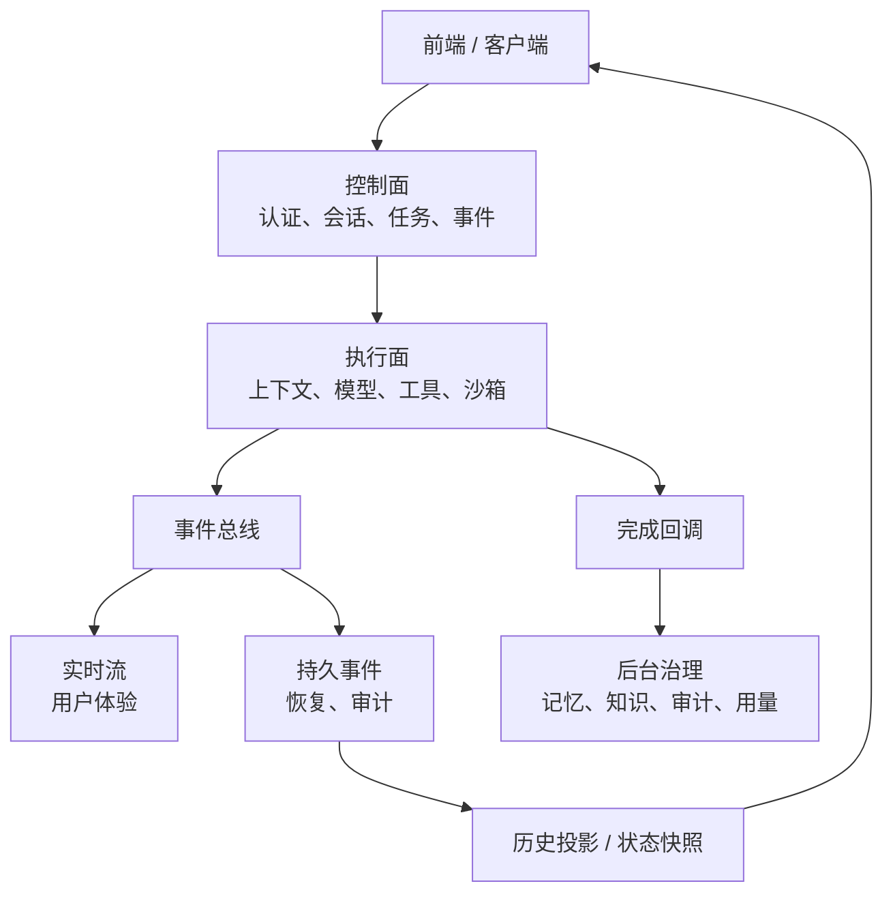

# 架构拆分笔记：控制面和执行面分开

Agent 项目从 demo 往长期维护走，真正的转折点不是接更多模型，而是把控制面和执行面分开。

模型执行是不确定的，业务控制必须确定。这两者混在一起，后面很多问题都会变得难排查。

## 单体阶段为什么会变重

早期一个服务做所有事：接用户请求，写消息，调模型，执行工具，推流返回。

这个阶段开发很快。但功能增加后，问题会集中出现：

- 模型慢会拖住业务 API。
- 工具失败会影响主请求。
- 沙箱任务耗时长，取消和超时不好处理。
- 后台任务和用户请求抢资源。
- 前端刷新后依赖执行内存。
- 审计、用量、记忆、知识索引都混在主链路里。

单体不是不能做，而是要知道它的边界。

## 更稳的拆分方式

控制面拥有业务事实：用户、会话、任务状态、事件、权限。执行面负责不确定执行：模型、工具、沙箱、上下文。

实时流服务体验，持久事件服务恢复。后台治理处理那些不该阻塞用户请求，但又必须完成的事情。

## 这个拆法的代价

链路变长是事实。一次请求可能跨控制面、执行面、事件总线、回调、后台任务。排查问题需要更多日志和 trace。

但它换来的是隔离：

- 执行面压力大时可以独立扩容。
- 后台任务失败不会阻塞用户请求。
- 前端恢复依赖持久事件，不依赖执行进程内存。
- 模型和工具失败不会直接污染业务入口。

## 踩过的坑

第一个坑，是业务服务直接跑模型。短期省事，长期会被延迟、取消、失败拖住。

第二个坑，是把实时流当历史。实时通道适合看过程，不适合做事实源。

第三个坑，是共享层膨胀。共享层只应该放稳定契约，不要变成所有临时代码的堆放地。

第四个坑，是内部接口缺少治理。服务拆开后，内部调用也需要认证、幂等、重试和审计。

第五个坑，是后台任务没有可观测性。记忆、知识、审计看似边缘，但会影响长期体验。

## 现在的记录

如果再做一次，我会更早补端到端事件测试。一次任务从提交、执行、工具、完成到后台任务，都应该能验证。

可观测性也要早做：模型延迟、工具失败、事件积压、后台任务延迟、沙箱健康，都要能看到。

一句话总结：架构拆分的目的不是显得复杂，而是把模型和工具的不确定性挡在业务控制面之外。

## Podcast 提纲

1. 为什么单体 Agent demo 后期会变重。
2. 控制面和执行面分别负责什么。
3. 实时流和持久事件为什么要分开。
4. 后台任务为什么也是治理面。
5. 共享层如何避免失控。
6. 内部接口为什么也要安全和幂等。
7. 如果重做，我会先补哪些观测和测试。
