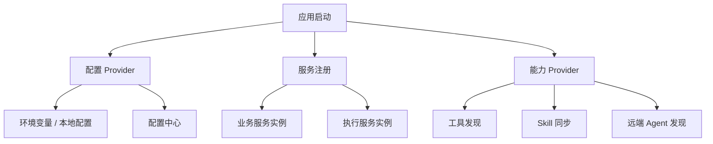

# 配置与发现笔记：把基础设施做成可替换入口

这篇记录的不是某个配置中心的使用教程，而是我对“配置与发现”的理解变化。

一开始配置只是 `.env`。模型地址、数据库、缓存、对象存储、沙箱开关，都可以写进去。后来服务多了、能力多了、环境多了，配置中心就不只是保存 key-value，它还可能成为能力发现入口。

## 为什么 `.env` 后面会不够

单服务、单环境时，本地配置很舒服。问题出现在多进程、多环境、多能力之后。

业务服务和执行服务需要服务注册。工具能力可能来自外部注册中心。Skill 可能需要平台分发。远端 Agent 也需要被发现和治理。

如果这些都写死在配置文件里，每次扩环境、灰度、切 provider 都会很痛。

## Provider 化的思路

重点不是必须使用某个基础设施，而是要有 provider 抽象。没有配置中心时，系统应该还能用本地配置跑起来；有配置中心时，平台能力可以从那里接入。

工具、Skill、远端 Agent 从哪里发现，不应该影响主执行逻辑。主流程只依赖统一 provider 结果。

## 配置中心不是自动热更新

这是一个容易误解的点。配置能从中心读取，不代表所有配置都能运行时热更新。

有些配置只在启动时读取，有些配置更新后需要重建上下文，有些配置会影响 provider 初始化，有些配置可以动态生效。这些边界必须写清楚。

## 踩过的坑

第一个坑，是把配置中心当 `.env` 替代品。只迁移 key-value，价值有限。

第二个坑，是基础设施逻辑渗透业务。代码里到处判断当前 provider，后面很难换。

第三个坑，是热更新边界不清。大家以为改了配置就生效，实际可能要重启。

第四个坑，是能力发现等于能力可信。一个工具被发现，只说明它存在，不说明它能绕过审批。

第五个坑，是缺少配置来源可观测。线上排查时，必须知道当前值来自哪里。

## 现在的记录

如果再做一次，我会从第一天定义配置优先级：环境变量、本地文件、配置中心、默认值之间谁覆盖谁。

能力 provider 要有版本、签名、审计和健康状态。尤其是工具和 Skill，它们会直接影响 Agent 行为，不能当普通配置项。

一句话总结：配置中心的价值不只是集中配置，而是让配置、服务和能力发现都能通过可替换 provider 接入。

## Podcast 提纲

1. 为什么 `.env` 后面会不够用。
2. 配置中心和能力发现有什么关系。
3. 为什么基础设施能力要做成 provider。
4. 热更新边界为什么要写清楚。
5. 能力发现为什么不等于能力可信。
6. 配置来源可观测性的重要性。
7. 如果重做，我会先设计哪些 provider 边界。
