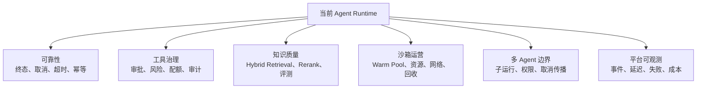
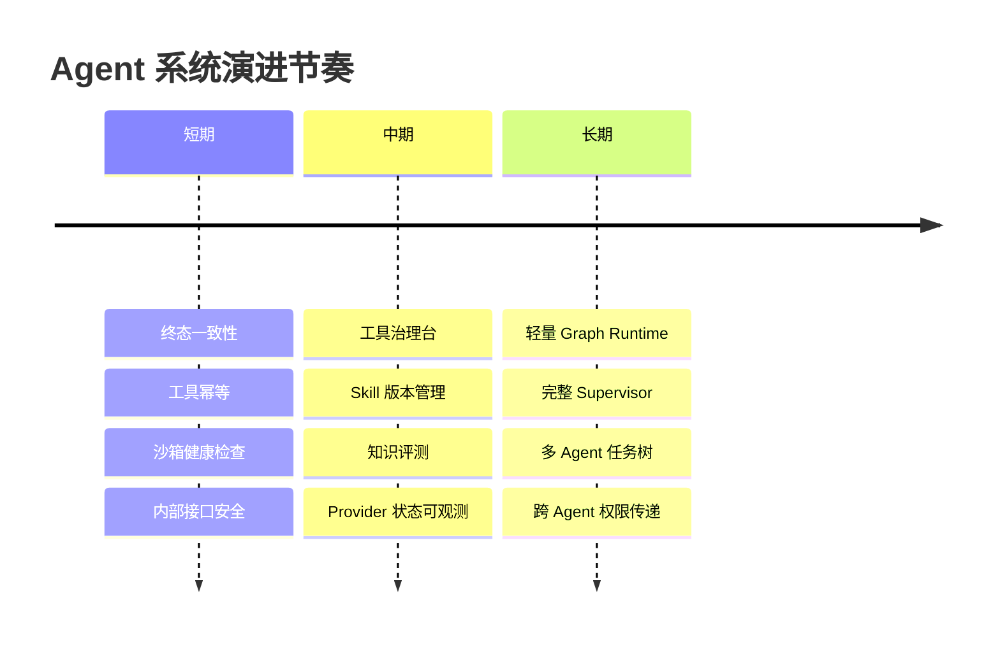

# 演进笔记：先治理，再谈更大的自动化

我现在对 Agent 系统演进的判断比以前保守很多。

以前总觉得下一步是更多模型、更多工具、更多 Agent、更复杂的自动化。后来发现，能力越多，治理压力越大。真正限制系统的，往往不是模型不够聪明，而是状态、权限、成本、隔离和可观测性不够。

## 不急着做的事

不急着做完整多 Agent Runtime。远端 handoff 有用，但它不等于完整多 Agent。真正的多 Agent 还要处理父子任务、取消传播、权限传递、上下文边界、子运行可视化。

不急着做复杂 Graph。Graph 有价值，但要建立在状态、事件和幂等之上。

不急着接更多知识源。没有评测、rerank、权限过滤和记忆治理，更多数据只会带来更多噪声。

不急着开放所有工具生态。工具、Skill、远端 Agent 越开放，供应链和审计压力越大。

## 更值得优先补的能力

可靠性是第一优先级。任务终态、取消、超时、事件一致性、工具幂等，这些不稳，后面都会反复返工。

工具治理要加强。审批、风险等级、配额、审计、签名、版本，这些决定工具生态能不能开放。

知识质量要能评估。混合检索、rerank、引用、评测集、记忆生命周期，比继续接更多数据源更重要。

沙箱要从“能跑代码”走向“能运营代码执行”。warm pool、资源限制、网络策略、健康检查、会话回收，都是生产问题。

## 演进路线

我不想再把“看起来高级”作为优先级。优先级应该来自失败模式：哪里最容易失控，哪里最难排查，哪里副作用最大，就先治理哪里。

## 踩过的坑

第一个坑，是把未来能力写成当前能力。比如“支持多 Agent”这句话，如果只是能 handoff，和完整 Supervisor Runtime 是两回事。

第二个坑，是为了高级感过早抽象。Graph、Supervisor、工具市场都很有吸引力，但时机不对会变成负担。

第三个坑，是只看功能不看运营。能跑一次和能长期运营，是两件事。

第四个坑，是缺少端到端观测。Agent 问题经常跨模型、工具、事件、前端、后台任务。没有观测，很难定位。

第五个坑，是开放生态带来的供应链风险。MCP、Skill、远端 Agent 越开放，权限、签名、版本、审计越重要。

## 现在的记录

如果再做一年，我会按这个节奏：

短期补可靠性和测试。中期做治理产品化。长期再做更强编排。

一句话总结：Agent 系统下一阶段不是更会聊天，而是更会治理。能限制、能隔离、能恢复、能审计，才敢让它做更多事。

## Podcast 提纲

1. 为什么我现在更重视治理而不是功能堆叠。
2. 多 Agent 为什么不能只看 handoff。
3. Graph 应该什么时候引入。
4. RAG 为什么要从检索走向评测。
5. Tool 和 Skill 的供应链风险。
6. 沙箱从执行能力到运营能力的差距。
7. 未来一年我会优先补哪些基础。
