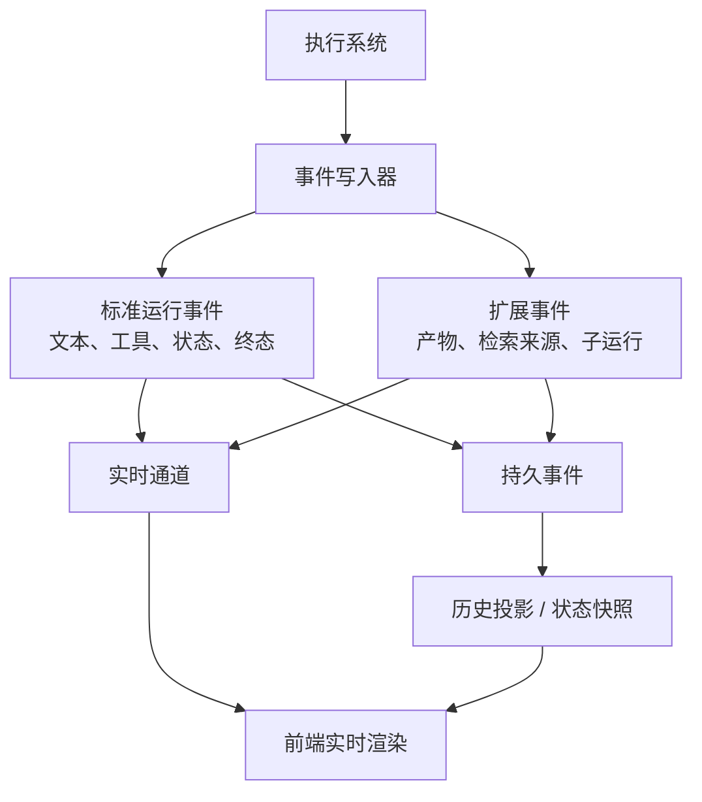

# 协议层笔记：流式输出之外，还要能恢复

我最开始以为协议层就是把 token 流给前端。后来发现，对 Agent 来说，文本流只是很小的一部分。

Agent 运行过程中会产生文本、推理、工具调用、工具结果、状态变化、用户确认、产物、错误、取消、完成。前端不仅要看到过程，还要能在刷新或断线后恢复。协议层如果没设计好，后面前后端会被各种临时字段绑死。

## 早期方案的问题

最早的流式协议很简单：delta、tool、done。

这对普通聊天足够，但对 Agent 不够：

- 工具调用需要展示参数、状态、结果、错误。
- 等待用户确认不是普通消息，而是运行暂停。
- 产物不是文本，需要独立事件承载。
- 检索来源、子任务状态、状态增量都不是 token。
- 实时流断了以后，前端需要从持久事件恢复。

如果前端直接理解后端内部对象，短期很快，长期很难维护。协议应该是稳定契约，而不是内部实现的镜像。

## 我现在的协议分层

实时通道服务体验，持久事件服务恢复和审计。两者最好来自同一套事件语义。

标准事件承载通用语义，自有扩展承载业务语义。扩展要有命名空间和版本意识，不要随手往标准字段里塞东西。

## 协议不只面向前端

Agent 平台里至少有几类协议边界：

运行事件协议面向前端和恢复。工具协议面向外部能力发现和调用。Skill 协议面向任务操作知识。Agent 间协议面向远端协作。

这些协议不能互相替代，也不应该全部写进主循环。

## 踩过的坑

第一个坑，是把实时流当事实源。实时流会断、会过期、会丢消息。恢复和审计必须依赖持久事件。

第二个坑，是事件字段随手加。今天加一个 `statusText`，明天加一个 `extraData`，后面没人知道语义边界。

第三个坑，是标准协议和扩展混在一起。扩展可以有，但要明确命名空间，不要污染通用事件。

第四个坑，是让前端猜状态。前端应该消费协议事件和快照，而不是猜后端执行到了哪一步。

第五个坑，是外部协议直接进主流程。工具、Skill、远端 Agent 都应该先适配成内部统一抽象，再参与执行。

## 现在的记录

如果重新做协议层，我会从第一天定义事件 schema。哪怕事件很少，也要语义清楚。

断线恢复也要早做。只要有流式输出，就一定会遇到刷新、重连、多端状态不一致。

一句话总结：协议层不是传输细节，而是执行系统、前端体验和外部能力之间的边界。

## Podcast 提纲

1. 为什么 token stream 不够表达 Agent 运行。
2. 实时流和持久事件分别解决什么。
3. 标准事件和扩展事件如何划边界。
4. 前端为什么不应该理解内部对象。
5. 工具协议、Skill 协议、Agent 间协议各自负责什么。
6. 断线恢复为什么要从协议层设计。
7. 如果重做，我会先定义事件 schema。
