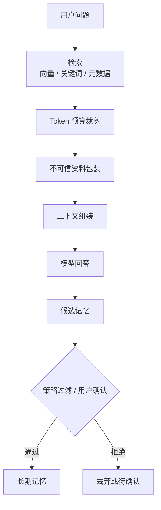

# RAG 笔记：检索结果不是系统指令

RAG 很容易被做成“向量库 + top-k + Prompt 拼接”。这个版本能快速出效果，但风险也很明显：检索到的内容不一定正确，不一定相关，更不能当成系统指令。

我现在更愿意把 RAG 看成上下文治理，而不是检索功能。

## 早期方案为什么不够

最早的思路很标准：

1. 文件抽文本。
2. 切 chunk。
3. 计算 embedding。
4. 用户提问时向量检索。
5. 把 top-k 结果塞进上下文。

这个方案能跑，但真实使用会遇到几个问题。

语义相似不等于任务相关。embedding 找到的是“像”，不是“有用”。没有 rerank 和评测时，top-k 只能算候选资料。

外部资料不可信。用户文件、网页、工具输出都可能包含干扰指令。直接拼进 Prompt，模型可能把资料里的指令当成系统要求。

上下文窗口有限。检索结果、历史消息、工具说明、记忆、附件一起进上下文，很快会膨胀。

长期记忆更难。模型会总结，但它不一定知道什么值得长期保存。

## 我现在的 RAG 链路

检索只是第一步。更关键的是预算、包装和注入方式。

检索结果应该以外部资料身份进入上下文。它可以帮助回答，但不能改写系统规则，也不应该伪装成用户消息。

记忆也要走策略。显式记忆可信度更高，自动抽取的记忆需要过滤。指令型、策略型、工具型内容不应该被长期记住。

## 需要承认的取舍

朴素 RAG 的优点是简单，能快速打通链路。缺点是质量不稳定。

没有 rerank 时，召回片段可能相关但无用。只有关键词 fallback 时，同义表达又容易漏。chunk 策略简单时，文档语义可能被切断。

严格包装外部资料会让模型表达没那么自然，但这是必要的。资料可以被参考，不能获得系统级话语权。

## 踩过的坑

第一个坑，是把文件内容直接当用户消息注入。这样会破坏对话边界，也容易引入 prompt injection。

第二个坑，是长期记忆越记越多。记忆越多不代表越聪明，很多时候只是噪声变多。

第三个坑，是没有检索评测。只靠肉眼感觉调 top-k 和 chunk size，后面很难判断是否真的变好。

第四个坑，是忽略权限和范围。项目资料、用户资料、全局记忆应该有清晰边界。

## 现在的记录

如果重新做，我会更早加入 hybrid retrieval：向量、关键词、元数据一起工作。然后补简单评测集和 rerank。

记忆会从一开始设计生命周期：待确认、激活、过期、合并、删除、冲突检测。

一句话总结：RAG 的核心不是找到了什么，而是这些资料能不能、该不该、以什么身份进入上下文。

## Podcast 提纲

1. 为什么 RAG 不是向量库功能。
2. top-k 拼 Prompt 的几个隐患。
3. 检索结果为什么不能当系统指令。
4. 长期记忆为什么比检索更危险。
5. Context Assembler 在安全上的作用。
6. Rerank 和评测为什么迟早要补。
7. 如果重做，我会怎样设计记忆生命周期。
