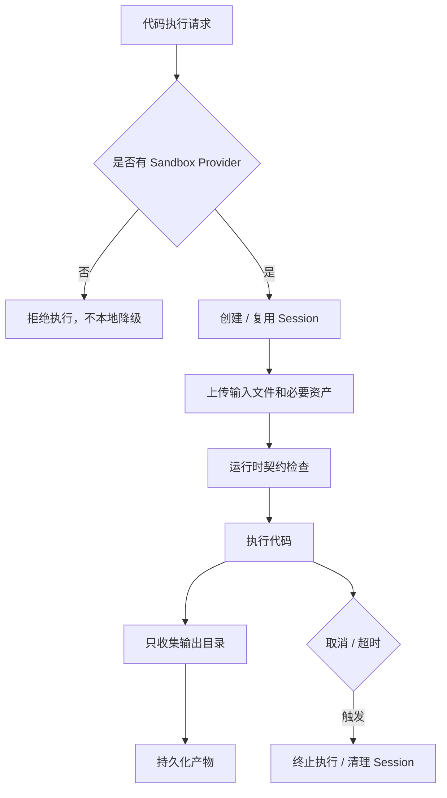

# Sandbox 笔记：代码执行不能碰宿主环境

代码执行是 Agent 里最有吸引力的能力之一。它能处理文件、生成图表、转换文档、分析数据，也能让 Agent 从“会说”变成“会做”。

但这也是风险最高的能力之一。模型生成的代码不可信，用户上传的文件不可信，外部依赖不可信。如果这些代码直接在宿主环境跑，风险不是 bug，而是安全事故。

我的底线很简单：没有沙箱，就不要执行代码。

## 早期诱惑：本地直接跑

最方便的做法，是在服务端开临时目录，直接跑 Python 或 Node。开发时非常舒服，调试快，产物也容易看。

但这个方案的问题很明显：

- 临时目录不等于隔离。
- 进程超时不等于资源受控。
- 默认网络开放风险很高。
- 依赖安装可能污染环境。
- 用户文件和输出文件边界不清。
- session 复用可能带来状态污染。

文档、表格、PDF 这些任务还依赖字体、转换工具、图像库、系统包。开发机能跑，不代表线上能跑。

## 更稳的沙箱链路

这里最重要的是“不本地降级”。没有 provider 时，宁可返回不可用，也不要偷偷在宿主机器跑。

文件系统要有契约：输入放哪里，工作目录在哪里，输出目录在哪里，哪些文件会被收集。否则模型把文件写得到处都是，最后不是收不到，就是收了不该收的。

运行时也要有 contract check。语言运行时、系统工具、字体、文档转换依赖，都应该尽早检查。

## Provider 能力不能假设一致

不同 provider 能力不同。有的支持网络策略，有的支持暂停恢复，有的能看资源指标，有的只提供基础执行。执行系统要基于 capability 判断，而不是想当然。

## 踩过的坑

第一个坑，是没有沙箱 provider 时本地降级。这是最危险的便利。

第二个坑，是输出目录没有约束。模型生成的文件散落在不同路径，产物收集会变得不可控。

第三个坑，是 session 复用不清理。复用能省时间，但也可能让上一次任务残留影响下一次。

第四个坑，是没有 runtime contract。等用户任务失败才发现缺字体、缺转换工具，排查成本很高。

第五个坑，是把代码执行当普通工具。它是高风险工具，需要更强隔离、更严格审计。

## 现在的记录

如果再做一次，我会更早做 warm pool，但配套资源配额和生命周期回收。

网络出站也应该放到基础设施层治理，不只依赖工具参数。产物只从约定输出目录收集，并且产物元数据要可审计。

一句话总结：代码解释器很有用，但它必须先进入可隔离、可销毁、可观察的运行环境。

## Podcast 提纲

1. 为什么代码执行是 Agent 的高风险能力。
2. 本地执行为什么不能作为默认路径。
3. 沙箱文件系统契约应该怎么设计。
4. Runtime contract 为什么比事后报错重要。
5. Provider capability 为什么要显式声明。
6. Session 复用的收益和风险。
7. 如果重做，我会怎样做 warm pool 和资源治理。
