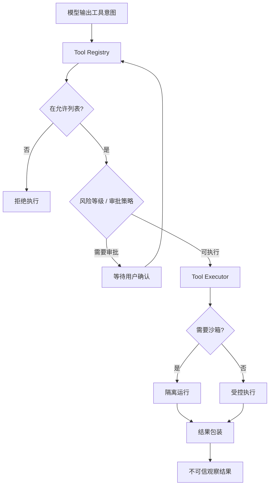

# Tool System 笔记：工具调用要有刹车

Agent 的能力来自工具，风险也来自工具。模型一旦能写文件、访问外部系统、执行代码、写记忆，就不只是“说错话”的问题了。

我现在对工具系统的理解很直接：模型输出的是意图，平台掌握的是执行权。

## 从 function calling 到工具治理

最早的工具设计就是 function calling：定义工具名、描述、参数 schema，模型返回工具调用，后端执行。

这个版本很轻，但缺几个关键问题：

- 当前用户是否有权限执行？
- 工具是否高风险？
- 是否需要用户审批？
- 一个 Turn 内最多能调用几次？
- 工具输出是否过长？
- 工具失败是否计入预算？
- 外部工具是否可信？
- 重试会不会重复产生副作用？

这些问题说明，工具不应该只是函数列表，而应该是受治理资源。

## 当前更稳的工具链路

执行端必须重新检查权限。不能只靠“模型看不到这个工具”来保证安全。

工具输出也不能直接塞回模型。它可能包含用户文件、外部网页、错误堆栈、甚至恶意指令。回到上下文前要包装、截断、标记。

## Tool 和 Skill 的边界

Tool 负责行动，Skill 负责方法。

比如代码执行是 Tool，但“如何生成一个可靠的文档”“如何处理 PDF”“如何校验表格产物”更像 Skill。它们是操作规程，不应该长期塞在系统 Prompt 里，而应该在需要时加载。

Skill 如果没有版本、来源、触发和资产治理，也会变成供应链风险。

## 踩过的坑

第一个坑，是只在模型可见列表里做权限。执行端不校验，就等于没有真正权限。

第二个坑，是工具风险不分层。读时间、写记忆、联网、执行代码、删除资源，这些风险完全不同。

第三个坑，是工具输出无限制。输出太长会撑爆上下文，输出不可信会污染下一轮推理。

第四个坑，是代码执行本地降级。模型生成的代码不可信，没有沙箱就不应该执行。

第五个坑，是外部工具接入太随意。工具来自哪里不重要，进入执行系统后必须经过同一套策略。

## 现在的记录

如果重新做工具系统，我会把它当成 Agent 时代的 API 网关：

- schema 只是入口。
- risk 和 policy 决定是否能执行。
- quota 控制调用频率。
- timeout 控制执行时间。
- audit 记录副作用。
- idempotency 降低重复执行风险。

一句话总结：工具越强，边界越要硬；模型可以提议行动，但不能直接拥有执行权。

## Podcast 提纲

1. 为什么 Tool 不是普通 function calling。
2. 模型意图和平台执行权的区别。
3. Tool Registry 应该承担哪些职责。
4. Tool 和 Skill 为什么要分开。
5. 外部工具为什么不能默认可信。
6. 代码执行为什么必须进入沙箱。
7. 如果重做，我会把工具系统做成 API 网关。
