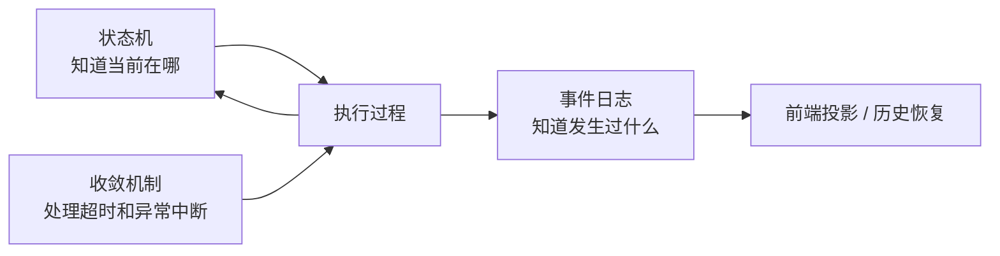
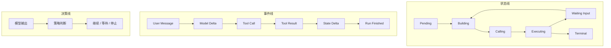

# Workflow 笔记：状态和事件比图更重要

做 Agent 工作流时，我一开始很想上 Graph。模型调用是节点，工具执行是节点，人工输入是节点，远端能力也是节点。节点之间用条件边连接，听起来很自然。

后来发现，Graph 不是第一步。真正的第一步是状态和事件：任务现在在哪，历史发生过什么，失败后能不能恢复。

## 为什么没有一开始做通用 Graph

通用 Graph 在白板上很好看。可一落地，每个节点都会追问：

- 节点状态存在哪里？
- 节点失败能不能重试？
- 重试会不会重复执行工具？
- 用户取消怎么传播？
- 等待用户输入后怎么恢复？
- 前端刷新后怎么还原运行过程？

如果这些问题没有答案，Graph 只是更复杂的内存调度。

我后来选择先做三件更基础的事。

状态机定义任务阶段。事件日志记录真实发生的动作。收敛机制处理长期不结束或执行方异常退出的任务。

这三件事不炫，但很重要。

## 工作流里的三条线

状态线回答“现在在哪”。事件线回答“发生过什么”。决策线回答“为什么往这条路走”。

Agent 的真实执行往往不是静态 DAG，而是循环、等待、恢复、取消混在一起。强行一开始画成完整图，容易让模型执行的复杂度隐藏在节点里。

## Graph 什么时候值得做

我不是反对 Graph。只是觉得它应该建立在状态和事件之上。

当任务开始出现这些需求时，Graph 就有价值：

- 明确的多阶段任务。
- 并行分支和条件合并。
- 可复用的人工审批节点。
- 子任务重试和超时策略。
- 长周期计划执行。
- 多 Agent 子任务树。

但 Graph Runtime 不应该另起事实源。节点执行结果仍然要写事件，人工输入仍然是状态，工具执行仍然要幂等。

## 踩过的坑

第一个坑，是把工作流等同于图。其实状态机加事件日志已经能覆盖很多 Agent 场景。

第二个坑，是只存当前状态。状态告诉你现在是什么，但解释不了为什么变成这样。

第三个坑，是只存事件但不做投影。事件能恢复历史，但前端需要当前视图。

第四个坑，是 Human In Loop 不进状态机。人工输入必须是执行状态，不是 UI 装饰。

## 现在的记录

如果再做一次，我会按这个顺序来：

1. 先做状态机和事件事实源。
2. 再抽象常见节点：模型调用、工具执行、人工输入、沙箱任务。
3. 最后做轻量 Graph，用来表达确实需要结构化编排的场景。

一句话总结：工作流不是从画节点开始的，而是从任务失败后还能不能还原现场开始的。

## Podcast 提纲

1. 为什么我没有一开始做通用 Graph。
2. 状态机、事件日志、Graph 分别解决什么。
3. Agent Loop 和 Workflow 的关系。
4. Human In Loop 为什么必须进入状态。
5. Graph 绕开事实源会带来什么问题。
6. 什么时候真的需要图执行。
7. 如何从状态机自然演进到 Graph。
